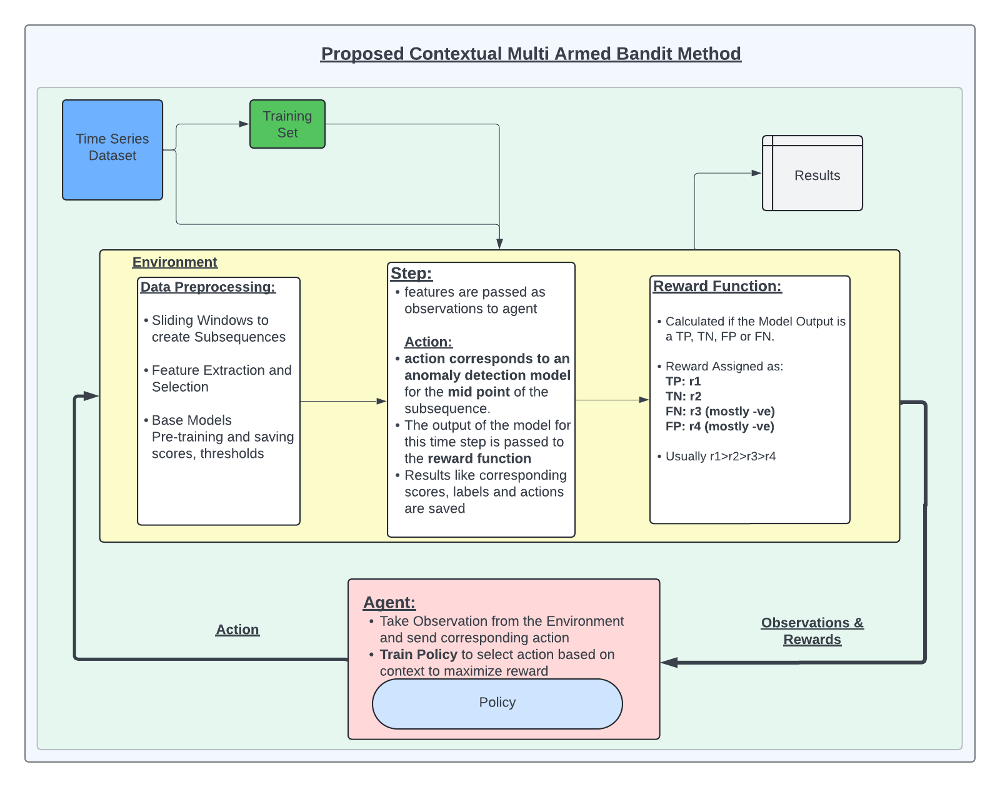

# Contextual Multi-Armed Bandit for Model Selection in Time Series Anomaly Detection

This is a code repository for the use of Contextual Multi-Armed Bandit for model selection in time series anomaly detection. The overall workflow is given in the diagram below:



## Installation

To run the code, install the required libraries listed in `requirements.txt` by executing the following command:

```bash
pip install -r requirements.txt

## Usage

- **Sliding Windows**: The sliding windows can be created using the 'src/Components/data_process.py' file.

- **Feature Extraction**: Time Series features can be extracted using the 'src/Components/feature_extractor.py' file.

- **Environment**: The custom environment can be initialized from 'src/Environment/environment_v6.py'. The base anomaly models should be pre-trained and the outputs should be passed as parameters to the Environment.

- **Training**: The Agent can be trained using the trainer in 'src/Environment/trainer.py'. The notebooks in 'notebooks/' also provide examples for training and evaluating the models.


